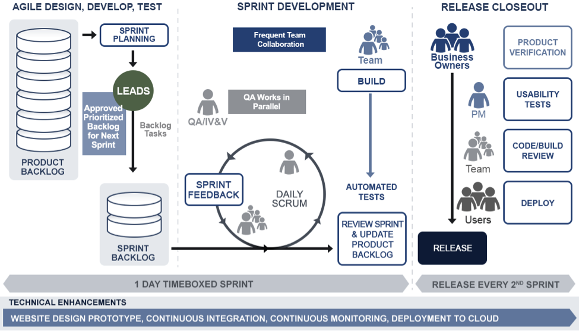

[nete peachtree app](http://nete-peachtree.herokuapp.com)

[peachtree original design concept](https://live.uxpin.com/b520be96922e9c950998a741bd5d3778ae7df860#/pages/24273706)

# PEACHTREE APPLICATION

NETE created the PeachTree application in response to GSA BPA RFQ: 4QTFHS150004. This application showcases our ability to deliver modern, agile, and quality solutions. The application name references our sponsoring agency; the name honors new and enlightened government procurement solutions. Our team has experience rapidly deploying and delivering open and Agile software solutions—specifically tailored to NIH requirements and end-user needs.

NETE’s solution leverages Open Source application programming Interfaces (APIs) for the FDA Drug, Device, and Food dataset.  Our [prototype ](http://nete-peachtree.herokuapp.com)is an interactive web tool used to inform and educate consumers about drugs and devices experiencing the most reported adverse events—such as food recall (enforcement actions) counts by state—and drug queries regarding commonly reported adverse events associated with a drug.

While Peachtree was made as a prototype, it can be leveraged for future products and can be extended as a full-fledged delivery and methodology platform. It was designed with openness in mind; it utilizes the open source community to push technology solutions to the forefront.

## AGILE MODEL

Our mature Agile model has been developed, implemented, and used successfully on other NIH projects such as: project iRePORT, project ReTRACE, and project FederalRePORTER. These projects demonstrate our robust solution, a mature and repeatable model that follows Agile manifesto principles.

We started tracking our sprints, using a [SlidesJS Presentation](http://slides.com/mikedklein/deck). Decomposed tasks, resulting from Sprint planning, are moved to Trello boards. For group messaging, we convene daily standups and use Slack. GitHub serves as our source code version control system. Our embedded Product Owner exercises full authority over adding and removing features and prioritizes the Features Backlog, based on user feedback and team progress. We define team roles as closely to the pure Agile structure as possible; this provides focus, ensuring a solid product and timely delivery.

## DESIGN AND DEVELOPMENT TEAM

We assigned one leader, responsible and accountable for our Pool Three Prototype Development. Our architecture owner (Agile solution architect) was responsible for modeling, identifying technology and tools, and collaborating with the team to determine the best business solution accommodating all identified requirements. Our multidisciplinary team includes the following labor categories—as specified in Attachment B & C—

1. (Category 1) Product Manager
2. (Category 2) Technical Architect
3. (Category 3) Interaction Designer
4. (Category 11) Agile Coach
5. (Category 6) Frontend Web Developer
6. (Category 8) DevOps Engineer
7. (Category 5) Visual Designer
8. (Category 4) Writer/Content Designer/Content Strategist
9. (Category 7) Backend Web Developer
10.(Category 9) Security Engineer
11.(Category 12)Business Analyst

Another member of our design and development team was a User-Researcher, who served as our usability tester.

## AGILE DESIGN AND DEVELOPMENT MODEL

The following provides an overview of our scrum implementation process:

1. Project Backlog
2. Sprint planning
3. Release deployment

These phases are tightly coordinated.

 
We set up a simple project board—using Trello—to track deliverables and design a backlog of potential user stories for each major scenario. Our team is empowered, self-organized, and accountable for delivering value within each daily sprint.

## DESIGN APPROACH

Our Agile Delivery Team created a working design [prototype](https://live.uxpin.com/b520be96922e9c950998a741bd5d3778ae7df860#/pages/24273706) for the Pool 3 Design Phase. This initial prototype demonstrates our agile delivery capabilities.

Our team assessed all requirements and needs, as a part of our Sprint Planning. Additionally, team leads evaluated, approved, and prioritized the backlog for the next Sprint.

Our human-centered design approach focuses on the following principles:

1. Making tangible prototypes of our ideas 
2. Performing iterations, based on feedback we receive
3. Applying what we learn directly from people
4. Designing sustainable solutions
5. Researching existing solutions
6. Defining our target audience
7. Interviewing product end-users
8. Brainstorming and bundling ideas into a robust solution

For example, we tailored a prototype that uniquely meets end-user requirements relating to FDA Drug and Device Adverse Events and Food Enforcement Actions. We made-up multiple user personas, selected from our corporate team to fulfill prototype roles, such as:

1. Avneet Hundal – Facility Administrator, who monitors the reported Adverse Events for Drugs and Devices.
2. Lily Chai – Physician involved in clinical trials management, who is interested in  for Drug and Device adverse events reports.

To provide optimal viewing and interactive experiences, our User Experience (UX) designers focused on crafting each targeted device. For content, we examine mobile, desktop, and tablet device interfaces. We present higher resolution device users with appropriate content and mobile users with content and layout appropriate for their limited real estate and quick access needs to critical information.

As our understanding evolved, rapid prototyping facilitated design iterations and quick changes. Continual feedback from the Product Owner and based on usability, 508 testing, and application security compliance drove these changes. We created stories and prioritized them, ensuring the most valued work was addressed and fully responded to user needs.

We used Bootstrap to develop our multi-device framework. As we developed and implemented the [Design Style Guide](Project Artifacts/NETE Software Design Style Guide, Best Practices and Patterns - JavaScript Technology Stack.docx), this allowed our team to verify functionality and design elements to be reused and ensure compliance with Section 508. For a more complete listing of the technologies used see our full technology stack [document](Project Artifacts/readme/TECHNOLOGY_STACK.md).

We devised the design and development lifecycle of our prototype, using open-source or freely available tools and technologies. Our design prototype started with conceptual wireframes in Axure and was refined in [UXPin](https://live.uxpin.com/b520be96922e9c950998a741bd5d3778ae7df860#/pages/24273706), using our design assets. Our application uses Bootstrap and AngularJS—as the front-end UI frameworks for rapid development—and NodeJS—for back-end support.

We used all open source technologies and frameworks, from products or tools created by corporations, such as AngularJs, to individual visualization frameworks, such as D3.Js, as envisioned by Mike Bostock. Our stack is built completely in javascript, using NodeJs with Express for the server-side language and Angular for the front. The visual pattern library and framework are themed with the [Paper](https://bootswatch.com/paper/) Bootswatch theme.
During Iteration 0 of our agile modelling approach, as we developed and evolved our application architecture, we identified the high-level scope and initial requirements stack. As part of the sprint planning, along with functional use cases, our team tackled technical demands. We kept scalability and future enhancements in perspective, employing a just-in-time (JIT) methodology.

We adhered to our Scrum framework for planning and executing our Prototype development. To put together the project backlog, we follow data analysis and APIs. Team members prioritize high priority, user stories into our Sprint implementation plan. Our PeachTree prototype evolved, based on the priority our team assigned to each item in the product backlog.

## DEVELOPMENT APPROACH

Our Agile Delivery Team created a working [prototype](http://nete-peachtree.herokuapp.com) for Pool 3 – Full Stack, using the open-FDA dataset and API. We used modern, free or open-source technologies such as: Angular JS, Bootstrap, Bower, Karma, Codeship, and Heroku. Our approach accommodates various architectural layers (i.e., frontend, backend, etc.). We deployed our prototype on Heroku, a Platform-as-a-Service (PaaS) provider that is highly regarded. Heroku offers free tiers to users, so recreating the application can be done free of charge.

Following our initial assessment, we convened a Sprint and Release Planning session to build our working model. During the sprint planning session, we developed a Six Sprint effort to implement across the three Use Cases. After two consecutive sprints, we had a production deployment. We created and checked the Sprint Plan into GitHub. Successive sprints were defined and implemented based on agreed upon priorities. In parallel to planning the Use Case development in Sprint 1, we identified open source technologies and user-centered design techniques to better replicate how an end-user would respond to our solution.

Our development approach included:

1. Writing unit tests for our code
2. Setting up or using a continuous integration system to automate running tests
3. Continuously deploying code to the PaaS provider
4. Setting up or using configuration management
5. Setting up or using continuous monitoring
6. Deploying our software in a container (i.e., using an operating-system-level virtualization)
 
We used an iterative and incremental approach, whereby feedback influenced subsequent work or versions of the prototype. We have provided the necessary [documentation](Project Artifacts/readme/INSTALLATION.md) to install and run our prototype on another machine. Our prototype and underlying platforms, used to create and run the prototype, are openly licensed or free of charge.

As we developed code, we simultaneously created unit tests, running unit tests on every Codeship build. As defects were identified, our developer resolved the defect within the same sprint. We continuously refined our designs, based on feedback. We implemented usability [testing](Project Artifacts/user_tests/) through multiple iterations of mockups and wireframe development. We performed 508 and accessibility testing using JAWS screen reader, the WAVE toolbar, and Keyboard Accessibility. These tests helped drive continuous improvement and enhance usability for users with disability. To facilitate Application Security testing are there security scans results in GitHub, if yes add link here, we used the free version of Acunetix web vulnerability scanner; few minor issues were reported and subsequently remedied.

## PROTOTYPE REPOSITORY

NETE created a [repository](https://github.com/NETESOLUTIONS/peachtree/) consisting of all prototype source code, design assets, and associated documentation, related to the design and development of our prototype. 
Add links to Installation and Deployment Steps here.

## Further Evidence

Artifact  | Link
:------------- | :-------------
Installation  | [INSTALLATION.md](Project Artifacts/readme/INSTALLATION.md)
Deployment  | [DEPLOYMENT.md](Project Artifacts/readme/DEPLOYMENT.md)
Technology Stack  | [TECHNOLOGY_STACK.md](Project Artifacts/readme/TECHNOLOGY_STACK.md)
Playbook | [USDigitalServicesPlaybook.md](Project Artifacts/readme/USDigitalServicesPlaybook.md)
John Papa's Style Guide | [JohnPapaStyleGuide.md](Project Artifacts/readme/JohnPapaStyleGuide.md)
